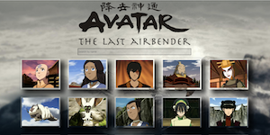
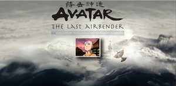
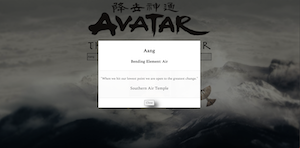
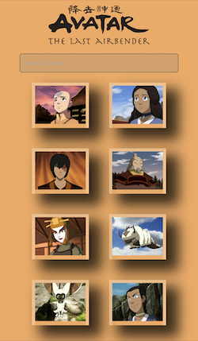

# Front End MERN

Front end project, using React, that interacts with and controls the data in the API built by a classmate.

[Deployed Site](https://avatar-the-last-air-bender.netlify.app/)

[Avatar The Last Airbender API by Adam Kaufman](https://atla-api-production.up.railway.app/)
[Adam's API Github Repository](https://github.com/akauf13/json-api)

## Desktop

## Mobile

